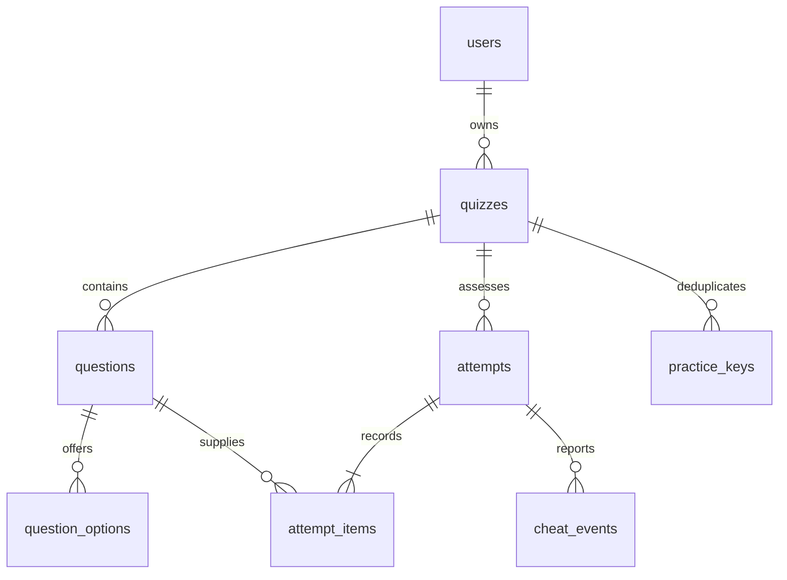

# EduTest — application and database architecture

Status: implementation specification, not executable migrations or a deployed system. [PLAN.MD](PLAN.MD) defines product behavior. This document is the technical source of truth for that scope.

## 1. Runtime and project structure

Use PHP 8.4, a compatible stable CodeIgniter 4 release, CodeIgniter Shield, MySQL 8.4/InnoDB, and Composer. Resolve compatible stable package versions during scaffolding and commit `composer.lock`. Required PHP extensions include the extensions required by the selected CI4/Shield versions plus `mysqli`, `intl`, `mbstring`, `fileinfo`, `bcmath`, `sodium`, and `gd`.

Use one CI4 application at the repository root with `public/` as the web root. Teacher pages are server rendered. Load a pinned local Vue 3 production distribution only on the quiz builder, using plain JavaScript and trusted templates without single-file components, Vue Router, Vite, npm, or a build pipeline. Student and public pages use vanilla ES modules and plain CSS.

```text
app/
  Controllers/{Teacher,Student,PublicSite}/
  Filters/                     # Authentication, CSRF, bearer tokens, throttling
  Services/{Authoring,Assessment,Practice,Reporting,Media,Identity}/
  Domain/{Quiz,Scoring}/       # DTOs, validation, policy and state types
  Models/                      # Owner-scoped data access
  Views/{layouts,teacher,student,public}/
  Database/{Migrations,Seeds}/
  Commands/                    # Deadline and file/key cleanup
  Schemas/                     # quiz-definition.v1.json
public/assets/{css,js,vendor}/
writable/{uploads,logs,cache}/
tests/{unit,integration,browser,fixtures}/
prototype-ui/                  # Layout reference only
```

Controllers handle transport and authentication. Services own transactions and business rules. Models never obtain an owner from submitted data: use the authenticated Shield user. Authorize nested content through `questions.quiz_id → quizzes.user_id`; a numeric ID, public ID, share token, option code, or media signature is not teacher authorization by itself.

Core services cover profile updates, quiz authoring/publication/duplication, inline media, canonical definitions, admission, progress, scoring, feedback, practice tickets/receipts, reporting, integrity-event ingestion, and quotas. Quota hooks initially allow all actions within infrastructure limits. There are no workspaces, organizations, memberships, subscription tables, or generic media repositories.

### Identity and routing

Shield owns accounts, credentials, email verification, password resets, login logs, and remember tokens. Use session authentication with CSRF for teacher requests and require verified email before production publishing.

Extend Shield's existing `users` table through an application migration. Create `App\Models\UserModel` extending Shield's `UserModel`, append the four EduTest fields to `allowedFields`, and configure it as `Auth::$userProvider`. Do not edit or copy Shield's vendor migration. Shield documents this extension mechanism in its [custom user-provider documentation](https://github.com/codeigniter4/shield/blob/develop/docs/customization/user_provider.md).

Use `users.username` as the canonical public handle, converted to lowercase before persistence. Rule: `^[a-z0-9_]{3,30}$`. Reserve fixed routes including `admin`, `api`, `app`, `assets`, `auth`, `login`, `logout`, `register`, `profile`, `media`, `teacher`, `student`, `quizzes`, `results`, `password`, `forgot`, `reset`, `verify`, `health`, `support`, `terms`, `privacy`, `public`, `index`, `robots`, `sitemap`, `favicon`, and `q`. Keep the reserve list synchronized with routing. Do not recycle usernames from soft-deleted users.

SSR paths include `/app`, `/app/quizzes`, `/app/quizzes/{id}/edit`, `/app/quizzes/{id}/results`, `/app/profile`, `/q/{share_token}`, and finally `/{username}`. Disable automatic controller routing. Explicit routes take precedence over the username fallback. Unknown, disabled, or inactive public profiles return 404. Public profiles query the extended user plus that user's explicitly listed, published, non-deleted, currently available quizzes. Do not expose the account email.

## 2. Database conventions and complete schema

Shield and framework tables are package-owned. The application extends `users` and owns seven tables: `quizzes`, `questions`, `question_options`, `attempts`, `attempt_items`, `cheat_events`, and `practice_keys`.

- InnoDB, `utf8mb4`, and `utf8mb4_0900_ai_ci`; code/token/key columns use ASCII binary collation.
- Application IDs are `BIGINT UNSIGNED`. User foreign keys exactly match the installed Shield `users.id` type, currently expected to be `INT UNSIGNED`.
- Store application event timestamps as UTC `DATETIME(6)` and set each connection timezone to `+00:00`.
- Use fixed-point `DECIMAL` scores. Never use binary floating-point arithmetic for persisted grading.
- JSON values are validated and canonicalized by PHP before persistence.
- All foreign keys restrict updates/deletes unless explicitly stated. Frozen quiz content and saved assessment results are never cascade-deleted.
- APIs serialize numeric IDs as decimal strings to avoid JavaScript integer precision loss.
- All boolean aliases receive explicit `CHECK (column IN (0,1))` constraints in migrations.

### 2.1 Users, quizzes, questions, and options

Apply this migration after Shield creates `users`:

```sql
ALTER TABLE users
  ADD display_name VARCHAR(120) NOT NULL,
  ADD bio VARCHAR(1000) NOT NULL DEFAULT '',
  ADD timezone VARCHAR(64) NOT NULL DEFAULT 'Asia/Tashkent',
  ADD public_page TINYINT(1) NOT NULL DEFAULT 0,
  ADD CONSTRAINT chk_users_public_page CHECK (public_page IN (0,1));
```

Validate display name, biography length, and IANA timezone in the profile service. Username and profile changes commit in one transaction.

```sql
CREATE TABLE quizzes (
  id BIGINT UNSIGNED AUTO_INCREMENT PRIMARY KEY,
  user_id INT UNSIGNED NOT NULL,
  public_id CHAR(32) CHARACTER SET ascii COLLATE ascii_bin NOT NULL,
  share_token CHAR(64) CHARACTER SET ascii COLLATE ascii_bin NOT NULL,
  mode VARCHAR(16) COLLATE utf8mb4_bin NOT NULL DEFAULT 'assessment',
  status VARCHAR(12) COLLATE utf8mb4_bin NOT NULL DEFAULT 'draft',
  listed TINYINT(1) NOT NULL DEFAULT 0,
  title VARCHAR(200) NOT NULL,
  description TEXT NOT NULL,
  instructions TEXT NOT NULL,
  revision INT UNSIGNED NOT NULL DEFAULT 1,
  version INT UNSIGNED NOT NULL DEFAULT 1,
  frozen_at DATETIME(6) NULL,
  time_limit_sec INT UNSIGNED NULL,
  opens_at DATETIME(6) NULL,
  closes_at DATETIME(6) NULL,
  passcode_hash VARCHAR(255) NULL,
  email_mode VARCHAR(8) COLLATE utf8mb4_bin NOT NULL DEFAULT 'optional',
  phone_mode VARCHAR(8) COLLATE utf8mb4_bin NOT NULL DEFAULT 'hidden',
  shuffle_questions TINYINT(1) NOT NULL DEFAULT 0,
  shuffle_options TINYINT(1) NOT NULL DEFAULT 0,
  feedback VARCHAR(12) COLLATE utf8mb4_bin NOT NULL DEFAULT 'at_end',
  show_score TINYINT(1) NOT NULL DEFAULT 1,
  show_answers TINYINT(1) NOT NULL DEFAULT 0,
  show_explain TINYINT(1) NOT NULL DEFAULT 0,
  cheat_check TINYINT(1) NOT NULL DEFAULT 0,
  practice_starts BIGINT UNSIGNED NOT NULL DEFAULT 0,
  published_at DATETIME(6) NULL,
  created_at DATETIME(6) NOT NULL,
  updated_at DATETIME(6) NOT NULL,
  deleted_at DATETIME(6) NULL,
  FOREIGN KEY (user_id) REFERENCES users(id),
  UNIQUE (public_id),
  UNIQUE (share_token),
  INDEX ix_quiz_user (user_id, status, deleted_at, updated_at),
  INDEX ix_quiz_listed (user_id, listed, status, deleted_at, published_at),
  CHECK (mode IN ('assessment','practice')),
  CHECK (status IN ('draft','published','closed','archived')),
  CHECK (feedback IN ('at_end','after_each')),
  CHECK (listed IN (0,1)),
  CHECK (shuffle_questions IN (0,1)),
  CHECK (shuffle_options IN (0,1)),
  CHECK (show_score IN (0,1)),
  CHECK (show_answers IN (0,1)),
  CHECK (show_explain IN (0,1)),
  CHECK (cheat_check IN (0,1)),
  CHECK (email_mode IN ('hidden','optional','required')),
  CHECK (phone_mode IN ('hidden','optional','required')),
  CHECK (time_limit_sec IS NULL OR time_limit_sec BETWEEN 1 AND 86400),
  CHECK (opens_at IS NULL OR closes_at IS NULL OR opens_at < closes_at),
  CHECK (show_explain = 0 OR show_answers = 1),
  CHECK (mode <> 'practice' OR (passcode_hash IS NULL
    AND email_mode = 'hidden' AND phone_mode = 'hidden' AND cheat_check = 0))
) ENGINE=InnoDB;

CREATE TABLE questions (
  id BIGINT UNSIGNED AUTO_INCREMENT PRIMARY KEY,
  quiz_id BIGINT UNSIGNED NOT NULL,
  pos SMALLINT UNSIGNED NOT NULL,
  type VARCHAR(16) COLLATE utf8mb4_bin NOT NULL,
  content TEXT NOT NULL,
  media_type VARCHAR(8) COLLATE utf8mb4_bin NULL,
  media_src VARCHAR(1000) NULL,
  explanation TEXT NULL,
  points DECIMAL(8,2) NOT NULL DEFAULT 1.00,
  time_limit_sec INT UNSIGNED NULL,
  text_answers JSON NULL,
  created_at DATETIME(6) NOT NULL,
  updated_at DATETIME(6) NOT NULL,
  FOREIGN KEY (quiz_id) REFERENCES quizzes(id),
  UNIQUE (quiz_id, pos),
  UNIQUE (id, quiz_id),
  CHECK (type IN ('single_choice','multi_select','short_text')),
  CHECK (pos > 0),
  CHECK (points > 0 AND points <= 10000),
  CHECK (time_limit_sec IS NULL OR time_limit_sec BETWEEN 1 AND 86400),
  CHECK (media_type IS NULL OR media_type IN ('image','audio','video')),
  CHECK ((media_type IS NULL AND media_src IS NULL)
    OR (media_type IS NOT NULL AND media_src IS NOT NULL))
) ENGINE=InnoDB;

CREATE TABLE question_options (
  id BIGINT UNSIGNED AUTO_INCREMENT PRIMARY KEY,
  question_id BIGINT UNSIGNED NOT NULL,
  pos SMALLINT UNSIGNED NOT NULL,
  code CHAR(16) CHARACTER SET ascii COLLATE ascii_bin NOT NULL,
  content TEXT NOT NULL,
  media_type VARCHAR(8) COLLATE utf8mb4_bin NULL,
  media_src VARCHAR(1000) NULL,
  is_correct TINYINT(1) NOT NULL DEFAULT 0,
  created_at DATETIME(6) NOT NULL,
  updated_at DATETIME(6) NOT NULL,
  FOREIGN KEY (question_id) REFERENCES questions(id),
  UNIQUE (question_id, pos),
  UNIQUE (question_id, code),
  CHECK (pos > 0),
  CHECK (is_correct IN (0,1)),
  CHECK (media_type IS NULL OR media_type IN ('image','audio','video')),
  CHECK ((media_type IS NULL AND media_src IS NULL)
    OR (media_type IS NOT NULL AND media_src IS NOT NULL))
) ENGINE=InnoDB;
```

Generate option codes on the server from 12 random bytes encoded as 16 URL-safe base64 characters. Codes are stable and never supplied for new options by the editor. The client may preserve an existing option ID/code while editing an unfrozen question. A code is unique within its question; cross-question uniqueness is unnecessary.

Publication validation:

- 1–200 questions per quiz.
- `single_choice`: 2–20 options, exactly one correct, `text_answers` NULL.
- `multi_select`: 2–20 options, at least one correct, `text_answers` NULL.
- `short_text`: no options and `text_answers` is a JSON array of 1–20 nonempty strings.
- True/false is a single-choice editor preset; it is not a separate stored type.
- Ordering and fill-blank are not accepted in the MVP.
- Normalize accepted text answers in PHP, reject values longer than 500 characters before or after normalization, and reject two values that normalize identically. Store only the original strings.
- A question/option needs nonempty content or media. Limit description to 5,000 characters, instructions/question/explanation to 10,000, and option content to 2,000.
- Validate media ownership through the quiz, allowed type/source combination, points precision, timers, and all settings before publishing.

Question reorder uses a transaction and temporary positions above the active range before final positions are assigned. Every authored-content mutation increments `revision` and every teacher mutation increments `version`. Publishing and first start revalidate while holding the quiz row lock.

### 2.2 Inline media lifecycle

There is no media table. Each question or option owns at most one reference:

- Uploaded image/audio: `media_type` is `image` or `audio`; `media_src` is a random relative key below `writable/uploads/`. It is never a public path.
- External video: `media_type` is `video`; `media_src` is the validated HTTPS provider/direct-MP4 URL.
- The application never creates shared local paths. Duplicating a quiz copies every uploaded file to a new random path before committing the copied rows.
- Replacing/removing media on an unfrozen draft updates the row transactionally and deletes the old file only after commit. Rollback deletes the newly staged file instead.
- Frozen media cannot change. Soft-deleting a frozen quiz does not remove its files.
- A daily cleanup command scans question/option references and deletes unreferenced staged/orphan files older than 24 hours. It never deletes a referenced path.

Image/audio upload is permitted only after the question/option row exists. Store a canonical extension chosen after validation. The signed delivery service maps that extension to a fixed MIME allowlist, so a MIME column is unnecessary.

### 2.3 Assessments and answers

```sql
CREATE TABLE attempts (
  id BIGINT UNSIGNED AUTO_INCREMENT PRIMARY KEY,
  quiz_id BIGINT UNSIGNED NOT NULL,
  revision INT UNSIGNED NOT NULL,
  public_id CHAR(32) CHARACTER SET ascii COLLATE ascii_bin NOT NULL,
  token_hash BINARY(32) NOT NULL,
  start_key CHAR(32) CHARACTER SET ascii COLLATE ascii_bin NOT NULL,
  start_hash BINARY(32) NOT NULL,
  name VARCHAR(120) NOT NULL,
  email VARCHAR(254) NULL,
  phone VARCHAR(32) NULL,
  ip VARCHAR(45) CHARACTER SET ascii COLLATE ascii_bin NULL,
  agent VARCHAR(512) NULL,
  status VARCHAR(12) COLLATE utf8mb4_bin NOT NULL DEFAULT 'in_progress',
  phase VARCHAR(20) COLLATE utf8mb4_bin NOT NULL DEFAULT 'answering',
  current_pos SMALLINT UNSIGNED NULL,
  version INT UNSIGNED NOT NULL DEFAULT 1,
  settings JSON NOT NULL,
  started_at DATETIME(6) NOT NULL,
  total_due_at DATETIME(6) NULL,
  close_at DATETIME(6) NULL,
  due_at DATETIME(6) NULL,
  submitted_at DATETIME(6) NULL,
  finish_reason VARCHAR(20) COLLATE utf8mb4_bin NULL,
  score DECIMAL(12,2) NULL,
  max_score DECIMAL(12,2) NOT NULL,
  percent DECIMAL(5,2) NULL,
  updated_at DATETIME(6) NOT NULL,
  FOREIGN KEY (quiz_id) REFERENCES quizzes(id),
  UNIQUE (public_id),
  UNIQUE (token_hash),
  UNIQUE (quiz_id, start_key),
  UNIQUE (id, quiz_id),
  INDEX ix_attempt_report (quiz_id, status, started_at),
  INDEX ix_attempt_due (status, due_at),
  CHECK (status IN ('in_progress','submitted','expired')),
  CHECK (phase IN ('answering','feedback','awaiting_next','complete')),
  CHECK (finish_reason IS NULL OR finish_reason IN
    ('completed','total_timeout','scheduled_close')),
  CHECK (max_score > 0),
  CHECK (score IS NULL OR (score >= 0 AND score <= max_score)),
  CHECK (percent IS NULL OR percent BETWEEN 0 AND 100)
) ENGINE=InnoDB;

CREATE TABLE attempt_items (
  id BIGINT UNSIGNED AUTO_INCREMENT PRIMARY KEY,
  attempt_id BIGINT UNSIGNED NOT NULL,
  quiz_id BIGINT UNSIGNED NOT NULL,
  question_id BIGINT UNSIGNED NOT NULL,
  pos SMALLINT UNSIGNED NOT NULL,
  choice_order JSON NOT NULL,
  status VARCHAR(8) COLLATE utf8mb4_bin NOT NULL DEFAULT 'pending',
  started_at DATETIME(6) NULL,
  due_at DATETIME(6) NULL,
  locked_at DATETIME(6) NULL,
  lock_reason VARCHAR(20) COLLATE utf8mb4_bin NULL,
  answer_codes JSON NULL,
  text_answer VARCHAR(500) NULL,
  save_ver INT UNSIGNED NOT NULL DEFAULT 0,
  saved_at DATETIME(6) NULL,
  submit_key CHAR(32) CHARACTER SET ascii COLLATE ascii_bin NULL,
  submit_hash BINARY(32) NULL,
  result VARCHAR(12) COLLATE utf8mb4_bin NULL,
  points DECIMAL(8,2) NULL,
  FOREIGN KEY (attempt_id, quiz_id) REFERENCES attempts(id, quiz_id),
  FOREIGN KEY (question_id, quiz_id) REFERENCES questions(id, quiz_id),
  UNIQUE (attempt_id, pos),
  UNIQUE (attempt_id, question_id),
  UNIQUE (attempt_id, submit_key),
  INDEX ix_item_due (status, due_at),
  CHECK (pos > 0),
  CHECK (status IN ('pending','active','locked')),
  CHECK (lock_reason IS NULL OR lock_reason IN
    ('answered','skipped','question_timeout','attempt_timeout')),
  CHECK (result IS NULL OR result IN ('correct','partial','wrong','unanswered')),
  CHECK (points IS NULL OR points >= 0),
  CHECK ((submit_key IS NULL AND submit_hash IS NULL)
    OR (submit_key IS NOT NULL AND submit_hash IS NOT NULL))
) ENGINE=InnoDB;
```

Each explicit assessment start creates one independent `attempts` row. Repeated name, email, phone, or IP values neither link attempts nor prevent a new start. A retry using the same `(quiz_id, start_key)` resolves to the existing attempt instead of creating another row.

Name is trimmed and required at 1–120 characters. Apply the quiz's `email_mode` and `phone_mode`: reject a value for a hidden field, require a nonempty valid value for a required field, and permit NULL for an optional field. Validate supplied email normally. Trim phone and accept 7–32 characters from digits, spaces, `+`, `-`, `(`, and `)`; it is unverified contact text. Store submitted email and phone without comparison copies.

Capture the successful start's network address from the server connection or explicitly trusted proxy chain, canonicalized as IPv4/IPv6 text in `ip`. Read `User-Agent` from the request, remove control characters, trim it, cap it at 512 bytes, and store NULL when absent. A retry never overwrites the initially captured values.

Keep statuses `in_progress`, `submitted`, and `expired`. Do not add `abandoned`, because a browser cannot report abandonment reliably and untimed unfinished attempts remain in progress. Do not add `source`, because offline results are not imported. Do not store `time_spent_sec`; derive elapsed time from item/attempt timestamps.

At admission, create one item per question. Item `pos` records randomized question order. `choice_order` is an ordered JSON array of that question's stable option codes, or `[]` for short text. `answer_codes` is NULL before any choice answer, an array while saved/locked, and `[]` for an explicit blank. `text_answer` keeps the original short-text response. Services enforce that only the answer shape matching the frozen question type is populated.

`attempt_items` remains separate from `attempts` because one attempt needs many ordered questions, independently saved/locked answers, per-question deadlines, grading, and resume state. It already serves the role of a session-answer table without another answer table.

The locked item stores `result` and rounded `points`. Teacher per-question analytics group by question ID, result, points, and elapsed timestamps. Per-option analytics are deferred; MySQL 8 `JSON_TABLE` can expand `answer_codes` later without a migration.

`settings` v1 captures total-time limit, closing timestamp, shuffle settings, feedback timing, score/answer/explanation visibility, integrity monitoring, and the identity-field modes used at admission. Do not include passcodes or hashes. Existing attempts always use captured settings.

### 2.4 Integrity events and practice keys

```sql
CREATE TABLE cheat_events (
  id BIGINT UNSIGNED AUTO_INCREMENT PRIMARY KEY,
  attempt_id BIGINT UNSIGNED NOT NULL,
  event_key CHAR(32) CHARACTER SET ascii COLLATE ascii_bin NOT NULL,
  type VARCHAR(24) COLLATE utf8mb4_bin NOT NULL,
  happened_at DATETIME(6) NULL,
  received_at DATETIME(6) NOT NULL,
  duration_ms INT UNSIGNED NULL,
  data JSON NOT NULL,
  FOREIGN KEY (attempt_id) REFERENCES attempts(id),
  UNIQUE (attempt_id, event_key),
  INDEX ix_cheat_timeline (attempt_id, received_at),
  CHECK (type IN ('tab_hidden','tab_visible','window_blur','window_focus',
    'fullscreen_exit','inactivity_start','inactivity_end'))
) ENGINE=InnoDB;

CREATE TABLE practice_keys (
  quiz_id BIGINT UNSIGNED NOT NULL,
  request_key CHAR(32) CHARACTER SET ascii COLLATE ascii_bin NOT NULL,
  expires_at DATETIME(6) NOT NULL,
  PRIMARY KEY (quiz_id, request_key),
  INDEX ix_practice_expiry (expires_at),
  FOREIGN KEY (quiz_id) REFERENCES quizzes(id)
) ENGINE=InnoDB;
```

The database name is `cheat_events`; product copy and teacher screens call them integrity events because they are signals, not proof. `data` permits only a bounded optional incident key. Accept at most 20 events per batch, 2 KB of data per batch, 2,000 events per attempt, and durations no longer than 24 hours. Treat receipt order as canonical and client occurrence time as untrusted.

`practice_keys` stores only quiz, random request key, and expiry. It holds no start time, identity, seed, score, answer, result, or settings. It supports 24-hour start deduplication and is not exposed through teacher APIs.

### 2.5 Migration order and relationships

Migration order: Shield migrations → extend `users` → quizzes → questions → options → attempts → items → cheat events → practice keys → configured framework session/cache tables. Production schema changes are forward migrations with backups; reverse migrations are for disposable environments.



## 3. Definitions, scoring, and content freezing

`QuizDefinition` v1 is a server-only DTO and JSON Schema containing schema version, quiz public ID/revision, metadata, policies, authored questions, inline media references, option codes/content/correctness, accepted text arrays, points, and explanations. The relational schema is authoritative. Export references never expose private filesystem paths.

Use separate allowlist serializers for teacher editing, public metadata, current student question, and permitted feedback. Never derive a student DTO by merely deleting a few fields from the teacher DTO. Current-question output excludes `is_correct`, `text_answers`, explanation, and answer-derived status.

Scoring uses integer hundredths and exact rational arithmetic with BCMath:

- Single choice: full question points only for the one correct option.
- Multi-select with `C > 0` correct options and `I > 0` incorrect options: numerator is `correctSelected × I − incorrectSelected × C`, denominator is `C × I`; clamp the numerator to `[0, denominator]`.
- If `I = 0`, use `correctSelected / C`.
- Short text: validate UTF-8, trim/collapse Unicode whitespace, and apply `mb_strtolower`; compare PHP strings exactly. Preserve punctuation and diacritics and do not perform accent folding or Unicode canonical normalization in v1.
- Round each item half-up to two decimal places once, then sum. Calculate percentage half-up from stored totals.
- Result is `unanswered` for empty input, `correct` for full credit, `partial` for a positive fraction below full, and `wrong` otherwise. A tiny partial result may round to 0.00 while retaining `partial` status.

Quiz state: draft → published; published → closed; closed → published; draft/published/closed → archived; archived → closed. Soft deletion is independent. Publication always validates the complete definition.

The first non-preview assessment or practice start freezes mode, title, description, instructions, questions, option codes, answer keys, accepted answers, points, explanations, media paths, and question timers under the quiz row lock. Freeze is permanent. Teachers duplicate a frozen quiz to change content. Availability, passcode, identity-field modes, total timer, shuffle, feedback, integrity, and listing changes apply only to later starts.

## 4. Assessment transactions and safe retries

### Admission and credentials

Before starting, the browser generates a 128-bit hex `start_key` and a 256-bit base64url attempt token with Web Crypto. Server accepts only exact encodings and stores SHA-256(token). Tokens stay in same-tab `sessionStorage`, travel in the Authorization header, and never appear in URLs or logs.

Admission locks the quiz and checks `(quiz_id, start_key)` before rejecting a retry due to closure. `start_hash` is a keyed hash of canonical name, email, phone, passcode, and token binding; it prevents an unkeyed digest from leaking low-entropy input. A matching retry returns the existing attempt without changing its IP or user-agent. The same key with a different hash returns 409.

For a new assessment: verify account/quiz availability, passcode, identity modes, definition, and quota; freeze content; insert the attempt with entered identity and server-captured IP/user-agent; create items; randomize positions and option-code arrays with cryptographically secure Fisher–Yates; and activate item one in one transaction. Matching identity data in another attempt has no effect.

### Autosave, answer lock, and Continue

There is no general idempotency table. Retry protection lives on the affected records:

- Draft save supplies `expected_save_ver` and the complete answer. On success, replace the answer and increment `save_ver`. If a lost-response retry finds version `expected + 1` and the stored canonical answer equals the submitted answer, return success; otherwise return 409 with authoritative state.
- Answer lock supplies a 128-bit `submit_key`, expected attempt version, expected save version, and final answer. Store a keyed canonical answer hash in `submit_hash`. A retry with the same key/hash returns the already committed item and current attempt state; changed payload returns 409.
- Continue supplies expected attempt version. If the item already advanced, return current authoritative state without advancing again.
- Timeouts have no submit key and are uniquely determined by locked item state and deadlines.

Lock order is quiz → attempt → item when the quiz is needed; routine progress locks attempt then item. Retry deadlocked transactions at most three times with jitter. Determine eligibility from database UTC time after locks are acquired, not client timestamps or initial receipt time.

The client serializes autosaves, debounces text by 500 ms, includes the complete final answer in lock, and retries a transport failure with the same key/data using exponential backoff capped at 10 seconds.

| State | Event | Result |
| --- | --- | --- |
| answering | Valid draft | Replace draft and increment save version |
| answering | Lock, after_each | Lock/score item; phase feedback |
| answering | Lock, at_end | Lock/score and activate next, or finish |
| feedback | Continue | Activate next, or open final review |
| answering | Question timeout | Lock saved draft; feedback or awaiting_next |
| awaiting_next | Continue/current state | Activate next, or finish |
| Any active phase | Attempt deadline | Finalize expired; phase complete |
| complete | Read/retry | Return permitted result; reject new mutation |

After the final immediate-feedback answer, finalize immediately and return question feedback plus `complete: true`; Continue opens final review. GET current state may reconcile a deadline and activate an `awaiting_next` item under lock, but it never submits new input and must not be prefetched.

### Deadlines

`attempts.due_at` is the earliest non-NULL value of `started_at + captured total limit` and captured scheduled close. `attempt_items.due_at` is the earliest of item start + question limit and attempt due time. At `now >= due_at`, new input is ineligible.

Question timeout scores only the stored draft and records logical lock time as the deadline. Cron never activates the next question. The next state/Continue request activates it at database time if the attempt remains valid. Attempt timeout locks active/pending items, preserves earlier awards, scores eligible stored drafts, gives unseen items zero, and finalizes once. Tie-breaking records scheduled close when total and closing deadlines are equal.

A minute cron reconciles due assessments/items in bounded locked batches. Results endpoints also reconcile overdue attempts. Untimed abandoned attempts remain in progress and are excluded from score aggregates.

## 5. Practice without persisted answers

Practice creates no attempts/items/events, server drafts, PHP sessions, or server result records. Browser `sessionStorage` keeps the start key, signed ticket, current position, timers, draft, and encrypted review receipts. If storage is unavailable, offer a clearly non-resumable in-memory session. Every question and grading action requires connectivity.

### Tickets and counting

POST start accepts a browser-generated 128-bit request key. In one quiz-row transaction, return an existing unexpired key without incrementing; otherwise enforce availability, validate/freeze content, insert a 24-hour `practice_keys` row, and increment `quizzes.practice_starts`. An expired key returns 410. Only an explicit new start generates a new key. This counter measures deduplicated starts within the ticket window, not people or completions.

Because `practice_keys` deliberately stores no settings, a retry after a lost start response reconstructs the same expiry and deterministic seed but captures the quiz's current configurable policies. Once a ticket reaches the browser, the browser reuses it and never calls start merely to refresh. This keeps practice storage minimal while making the rare lost-response behavior explicit.

Ticket format is base64url JSON plus HMAC-SHA256 using a dedicated versioned key. Payload includes `v`, `kid`, quiz public ID/revision, request key, issue/expiry times, deterministic randomization seed, and captured timer/shuffle/feedback policies. It contains no identity or answer key. Validate exact algorithm/version/shape, constant-time signature, expiry, revision, owner state, and matching `practice_keys` row.

Question and option order are deterministic from the ticket seed. Option identifiers are the stable 16-character database codes; the student never receives `is_correct`. Existing tickets continue after normal quiz closure/archive/soft deletion until expiry; account suspension invalidates them.

### Grading and review receipts

Grade against frozen content with the common PHP engine without database/session/cache/log writes. Both feedback modes return an encrypted review receipt. Immediate mode additionally returns permitted feedback; end mode returns acknowledgement and receipt only.

Use libsodium XChaCha20-Poly1305 with a fresh nonce and dedicated versioned key. Bind quiz, revision, practice key, and policy hash as associated data. Receipt plaintext contains question ID, canonical submitted answer, awarded hundredths, result, and expiry. Final review submits exactly one receipt per question, including blanks; validate all bindings, duplicates/missing questions, reconstruct authored content, and recompute the total from verified awards.

Do not log practice request/response bodies, tickets, receipts, Authorization headers, or answers in web access logs, debug/error tools, proxy/WAF traces, APM, analytics, or browser session replay. Operational logs may contain only route template, status, duration, and a random correlation ID. Set `Cache-Control: no-store`. Limit review bodies to 2 MiB, 200 receipts, and 8 KiB per receipt.

Practice timers and progression are learning aids. Receipt replay or regrading can be manipulated by a visitor but cannot affect teacher assessment data.

## 6. HTTP contracts

Use same-origin JSON under `/api/v1`, UTF-8, and UTC RFC3339 timestamps. Success envelope: `{data, server_time}`; errors: `{error:{code,message,fields?}, server_time}`. API field names remain descriptive even where database columns are shorter. IDs are strings, decimal values are strings, and booleans are booleans.

Teacher requests require Shield session, CSRF, owner scope, and `expected_version` on existing-quiz mutations. Quiz create/edit DTOs expose descriptive `email_mode` and `phone_mode` fields. Content mutations lock the quiz; stale versions return 409. Default page size is 20, maximum 100.

| Method and path | Input / output |
| --- | --- |
| GET `/api/v1/teacher/profile` | Own username and extended user fields |
| PATCH `/api/v1/teacher/profile` | Username, display name, bio, timezone, public-page flag |
| GET/POST `/api/v1/teacher/quizzes` | Paginated own quizzes / create draft |
| GET/PATCH/DELETE `/api/v1/teacher/quizzes/{quiz}` | Editor DTO / update / soft-delete |
| POST `/api/v1/teacher/quizzes/{quiz}/duplicate` | Copy definition and local files to a new draft |
| POST `/api/v1/teacher/quizzes/{quiz}/{publish,close,archive,restore}` | Lifecycle transition |
| POST `/api/v1/teacher/quizzes/{quiz}/questions` | Question with `content`, `text_answers`, and nested options |
| PUT/DELETE `/api/v1/teacher/quizzes/{quiz}/questions/{question}` | Replace or delete unfrozen question/options |
| PUT `/api/v1/teacher/quizzes/{quiz}/question-order` | Ordered question IDs |
| PUT/DELETE `/api/v1/teacher/quizzes/{quiz}/questions/{question}/media` | Upload/replace/remove question media |
| PUT/DELETE `/api/v1/teacher/quizzes/{quiz}/questions/{question}/options/{option}/media` | Upload/replace/remove option media |
| GET `/api/v1/teacher/quizzes/{quiz}/results` | Assessment aggregates and attempts with collected name/email/phone, or practice-start count |
| GET `/api/v1/teacher/quizzes/{quiz}/attempts/{attempt}` | Owner-only answers, timing, IP, user-agent, and integrity timeline |
| GET `/api/v1/teacher/quizzes/{quiz}/results.csv` | Final assessment rows; 409 for practice |
| POST `/api/v1/teacher/quizzes/{quiz}/preview` | Owner-only preview; no freeze/counter/results |
| POST `/api/v1/teacher/quizzes/{quiz}/preview/grade` | Stateless owner-only grading |
| GET `/api/v1/public/quizzes/{share_token}` | Public metadata, identity modes, and privacy notice |
| POST `/api/v1/public/quizzes/{share_token}/assessment-start` | Start key/token/name/email/phone/passcode; current state |
| POST `/api/v1/public/quizzes/{share_token}/practice-start` | Request key; ticket and first question |
| GET `/api/v1/assessment/{attempt}/state` | Bearer token; authoritative current state |
| PUT `/api/v1/assessment/{attempt}/items/{item}/draft` | Expected save version and complete answer |
| POST `/api/v1/assessment/{attempt}/items/{item}/lock` | Submit key, expected versions, final answer |
| POST `/api/v1/assessment/{attempt}/continue` | Expected attempt version; next/final state |
| POST `/api/v1/assessment/{attempt}/integrity` | Bounded event batch stored in `cheat_events` |
| GET `/api/v1/assessment/{attempt}/result` | Completed permitted review |
| GET `/api/v1/practice/questions/{position}` | Bearer ticket; sanitized question |
| POST `/api/v1/practice/grade` | Ticket + question/answer; receipt and optional feedback |
| POST `/api/v1/practice/review` | Ticket + receipt array; complete permitted review |

Question replacement edits options as nested children. New options omit ID/code; the server creates both. Existing IDs must belong to the question and retain their code. Media upload requires an existing question/option and includes `expected_version`; video attachment sends JSON with `media_type: video` and validated `media_src`, while image/audio uses multipart upload.

Public assessment metadata describes the form without exposing database names:

```json
{
  "identity": {
    "name": "required",
    "email": "optional",
    "phone": "hidden"
  }
}
```

Assessment start accepts identity fields allowed by those modes. The client cannot submit IP or user-agent:

```json
{
  "start_key": "49ed57598af648d688a8a4df46fdf256",
  "attempt_token": "browser-generated-256-bit-secret",
  "name": "Madina Nurmatova",
  "email": "madina@example.com",
  "phone": null,
  "passcode": null
}
```

Assessment lock example:

```json
{
  "submit_key": "49ed57598af648d688a8a4df46fdf256",
  "expected_attempt_version": 4,
  "expected_save_version": 2,
  "answer": {"choice_codes": ["u4zV2cQn8JmL0pXa"]}
}
```

Short text uses `{"text":"Paris"}`. An empty array or empty text is an explicit unanswered submission. Reject both answer shapes together, duplicated/foreign codes, and client-supplied points/result.

Current-state example, intentionally without answer keys:

```json
{
  "data": {
    "attempt_id": "c68e5a2f82024a72b23ed7804676b10a",
    "phase": "answering",
    "version": 5,
    "position": 2,
    "question_count": 10,
    "attempt_due_at": "2026-09-22T10:30:00.000Z",
    "item": {
      "id": "901",
      "type": "single_choice",
      "content": "Capital of France?",
      "media": null,
      "due_at": "2026-09-22T10:02:00.000Z",
      "options": [
        {"code":"u4zV2cQn8JmL0pXa","content":"Paris","media":null},
        {"code":"R7pK3vN1sT8aQ2wB","content":"Berlin","media":null}
      ],
      "save_version": 0,
      "draft": {"choice_codes": []}
    }
  },
  "server_time": "2026-09-22T10:01:00.000Z"
}
```

Feedback always includes result and submitted answer. Include numeric awards/totals only when score display is enabled, correct option codes/text only when answer disclosure is enabled, and explanations only when enabled. `at_end` lock responses expose no answer-derived result. Use captured settings, not the teacher's current quiz settings.

Status codes: 200 read/update/retry, 201 new resource/start, 401 invalid credential, 403 passcode/CSRF failure, 404 inaccessible owner resource/profile, 409 stale/locked/key conflict, 410 unavailable start or expired practice ticket, 413 oversized payload, 422 invalid input, and 429 throttled with `Retry-After`. Reusing a start/submit key with changed data returns 409.

## 7. Media and browser security

Store uploads outside `public/` under random paths. Validate size and MIME with fileinfo, re-encode images with GD to strip metadata, and inspect supported audio container signatures with a vetted pinned PHP parser. Reject SVG, executables, mismatches, invalid/oversized content, and image decompression bombs over 25 megapixels. Limits: images 5 MiB, audio 20 MiB.

External video URLs are HTTPS only, with no credentials, IP literals, or local hostnames. Parse exact YouTube/youtu.be/Vimeo hosts and IDs and generate safe provider embed URLs. A direct MP4 requires a public DNS hostname and `.mp4` path. Do not fetch remote URLs server-side. Tell students external media may expose their IP to its host.

Question/option `media_src` is never serialized directly. Issue five-minute signed URLs bound to quiz revision, question/option, authorized assessment item or practice ticket, expiry, and key ID. Verify underlying attempt/practice authorization when signing and serving. Support GET/HEAD and audio byte ranges; use a fixed extension-to-MIME map, `nosniff`, `no-store`, and no-referrer. Redact signatures from access logs.

Escape authored content and use text DOM APIs. CSP allows local scripts, selected provider frames, and required media hosts. Cookies use Secure, HttpOnly, and SameSite=Lax. Teacher writes use CI4 CSRF. Student mutations require explicit bearer credentials and same-origin checks; no broad CORS.

Resolve the assessment IP from the direct peer unless that peer is an explicitly configured trusted proxy; only then process the proxy's forwarding chain. Canonicalize with `inet_pton`/`inet_ntop` and reject malformed values. Never accept an IP in JSON. Sanitize `User-Agent` by removing control characters, trimming, and limiting it to 512 bytes before storage. Missing or invalid metadata becomes NULL and never blocks a valid start.

Before assessment admission, disclose that the teacher receives entered identity, IP address, browser information, answers, timing, and integrity events. IP addresses may be shared, dynamic, proxied, or VPN-based, and user agents can be spoofed; neither establishes identity or cheating. These fields inherit the attempt's retention and are visible only in owner-authorized attempt detail, not public responses, result-list rows, or practice records.

Baseline throttles: login 10/min/IP, assessment admission 20/min/IP and 10/min/IP/quiz, passcode failures 5/min/IP/quiz, practice grading 120/min/IP and 120/min/ticket, integrity batches 30/min/attempt. Throttle buckets are short-lived infrastructure data and independent from persisted attempt metadata. Trust forwarded IP headers only from configured proxies.

CSV includes student name/email/phone, status, score/max/percentage, elapsed seconds, submitted UTC time, and integrity-event count. It omits IP and user-agent by default. Stream only owner-authorized finalized assessments. Quote fields and prefix values that could be spreadsheet formulas after leading whitespace (`=`, `+`, `-`, `@`, tab, CR, LF) with a single quote.

## 8. Operations and deployment

Production uses PHP-FPM with Nginx/Apache, MySQL on a private interface, SMTP, TLS, and private filesystem storage. No runtime Node, Redis, queue worker, WebSocket, or microservice is required. Database sessions/cache allow later multiple PHP instances; moving private files to object storage remains a media-service adapter change.

Environment configuration includes application/base URL, DB connection and UTC timezone, SMTP, Shield verification/reset URLs, CI encryption key, signed-media key, practice ticket/seed/receipt keys, request-hash key, proxy allowlist, upload path/limits, and throttles. Use independent random 256-bit versioned keys. Retain old practice keys for at least 24 hours and old media keys for the signed-URL lifetime.

Deployment checklist:

1. Verify PHP extensions and MySQL availability. Local inspection found PHP 8.4 and Composer but no `mysql` CLI; this does not establish whether a server exists.
2. Resolve/lock Composer dependencies and copy pinned local browser assets with version/license records.
3. Provision private secrets, a least-privilege DB user, writable private directories, and the public document root.
4. Back up, run Shield migrations, extend `users`, then run the seven application-table migrations; verify user-ID FK type compatibility.
5. Configure mail, trusted proxies, CSP, log redaction, and production error handling without debug toolbar/profiler.
6. Run minute cron for deadlines and expired practice/throttle keys; run daily orphan-media cleanup. Use process locks and bounded batches.
7. Smoke-test both modes, profiles, protected media/ranges, expiration, retries, and CSV. Verify practice bodies are absent throughout the logging chain.
8. Enable encrypted nightly database/media backups with 30-day off-host retention and perform a restore test before launch.

Assessment data, including IP and user-agent, remains until a later explicit result-retention/deletion feature. Soft deletion blocks new admissions/listing but is not a physical purge. Suspending a user blocks public pages and new/existing student operations with a generic unavailable response. Monitor aggregate latency/errors, storage/DB capacity, mail failures, cron heartbeat, overdue attempts, and orphan cleanup. Keep ordinary infrastructure logs for 14 days without credentials, tokens, or practice bodies.

## 9. Verification plan

Unit tests:

- All single-choice and multi-select subsets, zero floor, no-incorrect-option case, fractional rounding, and result labels.
- Short-text Unicode whitespace/case/punctuation/diacritics, invalid UTF-8, overlength input, and duplicate `text_answers` after normalization.
- Question-type validation: only three stored types; true/false preset; rejected ordering/fill-blank.
- Ticket/receipt/media signature tampering, expiry, key rotation, and policy binding.
- Deadline precedence/ties and canonical start/submit hashes.

MySQL integration/API tests:

- Shield creates users first; extension migration and custom user provider read/write all profile fields; registration/login/reset remain valid.
- Owner isolation for quizzes, nested options, inline media, reports, and public profiles.
- Stable random 16-character option codes remain unique within a question and never reveal correctness in student output.
- `text_answers`, `choice_order`, and `answer_codes` validate/round-trip as JSON; nonmatching answer shapes fail.
- Publication/first-start races freeze content and files permanently.
- Concurrent starts with identical identity data create independent attempts when their start keys differ; a retried start key creates exactly one attempt.
- Hidden identity fields are rejected, required fields are enforced, optional fields accept NULL, and phone/email validation follows the captured modes.
- Lost-response retries for start, save, lock, and Continue succeed once; changed data under a reused key conflicts; no duplicate score/progression occurs without a general idempotency table.
- Deadline/cron/lock races, exact boundary behavior, disconnection, feedback pause, and unseen-zero scoring.
- Per-question results and CSV work without response join tables; practice exposes only aggregate starts.
- Practice start deduplication, expiry/cleanup, receipts, no preview counts, and no answer/result persistence in DB, session, cache, logs, analytics, or teacher APIs.
- Practice never stores identity, IP, or user-agent. Assessment IP resolution trusts only configured proxies; malformed forwarding values cannot spoof the stored address.
- User-agent control characters are removed and length is bounded. Only the quiz owner can read IP/agent in attempt detail; public metadata, result lists, and CSV omit them.
- Inline upload validation, replacement rollback/commit cleanup, duplication to unique paths, signed delivery, ranges, unauthorized access, and safe orphan cleanup.
- `cheat_events` deduplicate and populate the teacher integrity timeline while retaining the privacy/event limits.

Browser tests cover responsive builder/profile/list/results layouts, all question/media types, keyboard/screen-reader support, saving/retry notices, same-tab refresh, storage failure, immediate/end feedback, score/answer disclosure combinations, and practice reconnect/expiry. Confirm no answer key appears in student HTML or current-question JSON.

Load baseline: 50 concurrent assessment students using realistic start/save/lock traffic and a separate 50-user practice run. Record hardware, dataset, p50/p95 latency, and errors. Require one attempt per unique start key, zero lost/duplicated answers, and no unhandled 5xx; target p95 below one second for small JSON operations on staging, excluding upload/media/third-party delivery.

Schema checks must confirm exactly the seven application tables, the four added user columns, and no `quiz_participants`, `participant_id`, `attempt_limit`, `require_email`, `email_key`, removed table names, or `normalized_*` columns.

Later offline exports share language-neutral scoring fixtures with PHP, embed local assets, warn about discoverable answer keys/external video, and never import results. PDF and AI/import remain future consumers of `QuizDefinition`.

### Reference sources

- [CodeIgniter installation](https://www.codeigniter.com/user_guide/installation/index.html) and [requirements](https://codeigniter.com/user_guide/intro/requirements.html): verify against the pinned release during scaffolding.
- [Shield custom user provider](https://github.com/codeigniter4/shield/blob/develop/docs/customization/user_provider.md): supported extension of the Shield user model and fields.
- [Shield authentication migration](https://github.com/codeigniter4/shield/blob/develop/src/Database/Migrations/2020-12-28-223112_create_auth_tables.php): user-ID compatibility reference; the installed migration is authoritative.
- [Vue without a build step](https://vuejs.org/guide/quick-start) and [production deployment](https://vuejs.org/guide/best-practices/production-deployment): use a pinned local production distribution.

Defaults and product boundaries are defined in PLAN.MD. No workspace/organization, student account, backward navigation, teacher-only feedback, ordering/fill-blank, distinct true/false type, or offline result import is implied.
